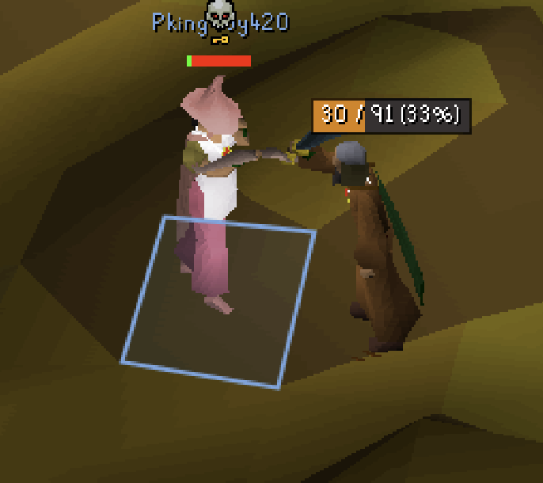
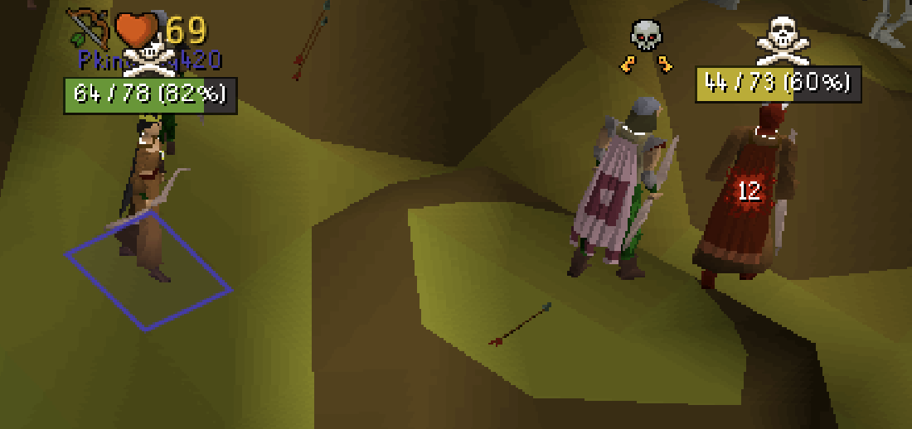
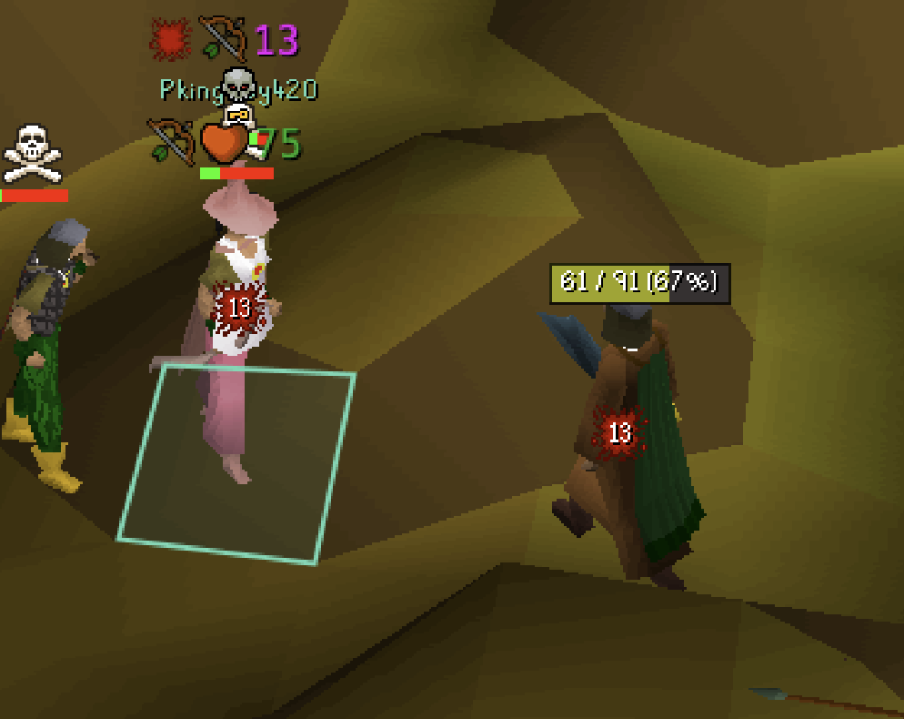
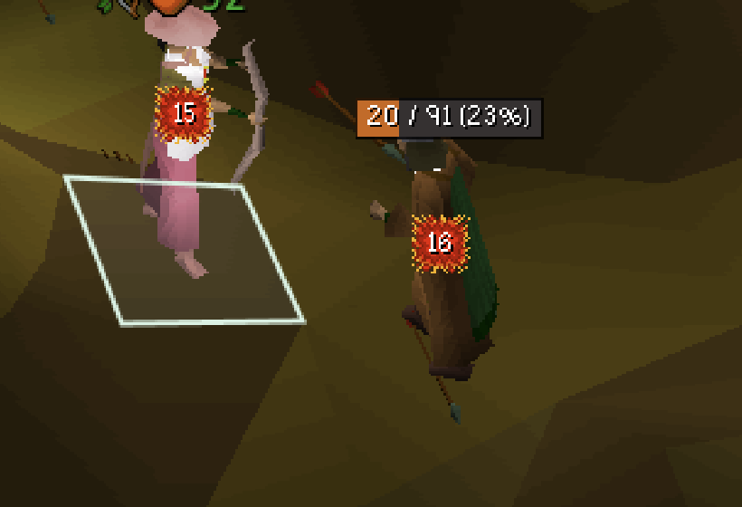
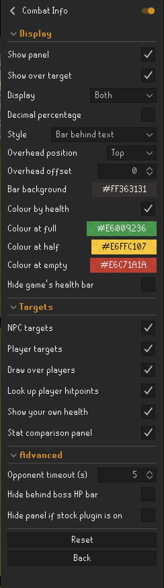

# Combat Vitals

Opponent health for NPC and player targets, drawn over the target instead of
only in a corner panel, and honest about what the number is worth.

A standalone replacement for RuneLite's built-in **Opponent Information**.

<p align="center">
  
</p>

<p align="center"><em>A player target at 33%. The number comes from the hiscores;
the bar is sized to the text so the two never collide.</em></p>

---

## Contents

- [Why this exists](#why-this-exists)
- [Features](#features)
- [About that number](#about-that-number)
- [Watching it work](#watching-it-work)
- [How it compares to Opponent Information](#how-it-compares-to-opponent-information)
- [Settings](#settings)
- [Compatibility](#compatibility)
- [Privacy and network use](#privacy-and-network-use)
- [How it works](#how-it-works)
- [Troubleshooting](#troubleshooting)
- [Building from source](#building-from-source)
- [Credit](#credit)
- [Licence](#licence)

---

## Why this exists

Opponent Information draws a panel in the top-left corner. You watch a fight in
the middle of the screen and read the health in the corner, and the number it
shows is a guess presented in the same typeface as a fact.

This plugin draws the readout **on the target**, and documents exactly how much
the number can be trusted, because the honest answer is "mostly, except at the
one moment you care most", and nobody says so.

## Features

**Overhead rendering.** The readout is drawn at the target in the game world.
Three styles:

| Style | Behaviour |
|---|---|
| **Bar behind text** | Draws a health bar sized to fit the text, with the text inside it. The bar carries the colour, the text stays white. |
| **Text above health bar** | Lifts the text clear of the game's own bar rather than covering it. |
| **Text only** | Draws where it falls. Will overlap the game's bar. Included for completeness. |

**Works on player targets**, not just NPCs. No other Plugin Hub plugin draws
overhead health for players.

**Both sides of the fight, in one visual language.** Your own health can be
drawn the same way as your opponent's. Other plugins can show your health, but
none of them will match this readout. You would get yours in one style and
theirs in another, side by side.

<p align="center">
  
</p>

<p align="center"><em>Yours on the left, theirs on the right, identical styling.
Your own number comes from the hitpoints orb, so it is exact, never recovered.</em></p>

**Stat comparison** against a player opponent, from the same cached hiscores
result the health lookup already fetched. No second request.

**Vertical placement** of Top, Middle or Bottom plus a pixel offset, because a
large NPC's name plate and the top-of-screen boss bar both crowd the space above
their head, and the right answer differs per monster.

**Configurable colour ramp.** Three stops (full, half, empty), each with an
alpha channel. Interpolated, so the colour slides rather than snapping between
bands.

**Display formats.** Hitpoints, percentage, or both, with optional decimal
precision on the percentage.

**Configurable opponent timeout.** How long the readout lingers after combat
ends. Opponent Information fixes this at five seconds; here it is 1–60.

**Gets out of the way.** Stands down when the game's own boss health bar is
showing the same target, and hides its panel while Opponent Information is
enabled so the two never stack in the same corner. Both are switchable.

## About that number

**Opponent health is never sent to your client.** The server broadcasts a health
*bar*: a ratio out of a fixed scale. Every plugin that shows a number, this one
and RuneLite's built-in included, is inverting that ratio to guess.

The scale is **30**. That was measured on a live world, not assumed.

### What that means

**NPCs at or below 30 max hitpoints are exact.** A Guard on 22 resolves to one
value, always. No guessing involved.

**Players never are.** Above 30 max hitpoints the ratio maps to a band of three
or four possible values, and the number shown is the middle of that band.

For an 88 hitpoint opponent showing ratio 10, the true health is 28, 29 or 30.
The readout says 29. That is the best single guess available, never wrong by
more than one, but it is still a guess, and RuneLite's built-in plugin renders it
identically to the maximum beside it, which it genuinely knows.

| Max hitpoints | Midpoint exactly right | Worst error |
|---:|---:|---:|
| 45 | 67% | 1 |
| 88 | 34% | 1 |
| 99 | 30% | 2 |

### The error that actually matters

Quantisation is the small problem. This is the large one:

> **After your opponent eats, the health bar you can see lags behind.**

Measured across 386 cross-checked readings from a real fight between two
accounts, each logging its own true hitpoints and the ratio it observed for the
other:

- Every reading that was wrong was wrong in the **same direction**, showing
  less health than the target actually had.
- Typical catch-up: **two game ticks**. Worst observed: **four ticks**.
- Worst single reading: **19 hitpoints stale.**

Nothing in the client API reports that an opponent ate. This cannot be detected,
flagged, or corrected. Not by this plugin, and not by RuneLite's built-in one,
which carries the identical error silently.

**The practical version:** trust the number while you are trading hits. Distrust
it for a second or two after they eat, which is exactly when you most want to
trust it. That is a property of the game's networking, not of any plugin.

Method, numbers and the cross-account analysis script are in
[BRIEF.md](BRIEF.md) under Phase 0.5 and [`docs/phase-0.5/`](docs/phase-0.5/).
The raw captures are deliberately not committed: they name real accounts.

### Watching it work

The same fight, as the target drops. The colour ramp is interpolated, so it
slides rather than snapping between bands:

| 67% | 33% | 23% |
|:---:|:---:|:---:|
|  |  |  |

Real PvP, not a test dummy: skulled, in the wilderness, hitsplats landing. The
readout stays legible over a moving target against cave-floor terrain, which is
the case that broke every earlier iteration of this overlay.

## How it compares to Opponent Information

| | Opponent Information | Combat Vitals |
|---|---|---|
| Corner panel | Yes | Yes |
| Drawn at the target | No | Yes |
| Overhead for players | No | Yes |
| Colour by health | No | Yes, three configurable stops |
| Opponent timeout | Fixed 5s | 1–60s |
| Player hiscores lookup | Always on, no switch | On by default, switchable |
| Documents its own accuracy | No | Yes |
| Combat stat comparison panel | Yes | Yes |
| Shows your own health too | No | Yes |

## Settings

### Display

| Setting | Default | What it does |
|---|---|---|
| Show panel | On | Corner panel, like the stock plugin |
| Show over target | On | Overhead readout in the game world |
| Display | Both | Hitpoints, percentage, or both |
| Decimal percentage | Off | One decimal place on percentages |
| Colour by health | On | Fade the readout as health drops |
| Colour at full / half / empty | Green / amber / red | The three gradient stops, with alpha |
| Overhead style | Bar behind text | See the table above |
| Bar background | Opaque black | Fill behind the health bar. Lower the alpha to let the game's bar show through |
| Overhead position | Top | Top, Middle or Bottom relative to the target |
| Overhead offset | 0 | Extra height in pixels, ±200 |
| Hide game's health bar | **Off** | See the warning below |

> **⚠️ Hide game's health bar.** The game exposes no way to hide the health bar
> alone. This suppresses the target's entire 2D layer, which also removes their
> **name, hitsplats and overhead prayer icons**. That is a poor trade in PvP.
> It is off by default and this is the only setting here that can cost you
> information.

### Targets

| Setting | Default | What it does |
|---|---|---|
| NPC targets | On | Show the readout when fighting NPCs |
| Player targets | On | Show the readout when fighting players |
| Draw over players | On | Off keeps players in the panel only |
| Look up player hitpoints | On | Hiscores lookup for the opponent's max hitpoints |
| Show your own health | Off | Draw your health over your character while engaged. Exact, from the orb |
| Stat comparison panel | Off | Compare your combat stats to a player opponent's, in the panel |

<p align="center">
  
</p>

### Advanced

| Setting | Default | What it does |
|---|---|---|
| Opponent timeout | 5s | How long the readout stays after combat ends |
| Hide behind boss HP bar | On | Stand down when the game's boss bar shows the same target |
| Hide panel if stock plugin is on | On | Avoid stacking two panels in one corner |

## Compatibility

**Opponent Information.** Safe to run both. This plugin hides its own panel
while the stock one is enabled, so you get the stock panel plus this plugin's
overhead rendering. Turn the stock plugin off to see this one's panel, or turn
off *Hide panel if stock plugin is on* to force both.

**Entity Hider.** If Entity Hider is hiding an actor's 2D layer, the game's
health bar is already gone and this plugin's overhead readout is unaffected,
since it draws independently.

**Boss health bar.** When the game shows its own top-of-screen bar for your
target, this plugin stands down by default rather than duplicating it.

## Privacy and network use

**One request type, to Jagex.** When you engage a player, their display name is
sent to Jagex's own hiscores service to look up their Hitpoints level, so their
health can be shown as a number rather than a percentage. One request per
opponent, cached for an hour, shared with RuneLite's own hiscore cache so
enabling several plugins cannot multiply requests.

The request is made only in direct response to you engaging that specific
target. Never speculatively, never for bystanders, never for more than one
player at a time.

Turn it off with **Targets → Look up player hitpoints**. Player targets then
show a percentage. RuneLite's built-in Opponent Information performs the same
lookup with no way to disable it.

**Nothing else leaves your machine.** No account identifiers, no telemetry, no
third-party servers, no data about other players sent anywhere.

## How it works

The server computes the health bar as:

```
healthRatio = 1 + (healthScale - 1) * health / maxHealth
```

with integer division, and forces `healthRatio = 0` when health is 0. Inverting
that gives a *range* of healths consistent with what you can see, which collapses
to a single value only when `maxHealth <= healthScale`.

Maximum health comes from the NPC cache for monsters, and from the hiscores for
players. Without it, only the fraction of the bar is knowable, which is why an
unranked player degrades to a percentage rather than a wrong number.

**Your own health skips all of this.** The client knows it exactly, from the
hitpoints orb, so it is never put through the recovery. Printing a guessed 29
where the truth is a known 30 would be absurd, and would undermine the only
claim this plugin makes. The readout is exact for you, exact for small NPCs, and
banded only where the data genuinely is.

The recovery is pure arithmetic with no client dependency, and is covered by
unit tests including exhaustive checks that the recovered range always contains
the true health, and that the midpoint is never off by more than half the range
width, across every `(maxHealth, health)` pair up to 120.

The readout is rebuilt once per game tick and published as an immutable
snapshot. Overlays render that snapshot and compute nothing themselves, because
they run every frame while the underlying bar changes only on a tick.

## Troubleshooting

**Nothing appears when I attack something.** The readout only tracks a target
*you* engaged. Being attacked does not trigger it, by design.

**The panel never shows.** Opponent Information is probably enabled, and this
plugin hides its panel to avoid stacking. Disable the stock plugin, or turn off
*Advanced → Hide panel if stock plugin is on*.

**A player shows a percentage instead of a number.** Either the hiscores lookup
is off, the lookup has not returned yet (the first one is asynchronous and takes
a moment), or the player is unranked. All three degrade to a percentage rather
than showing something wrong.

**The text sits on top of the game's health bar.** Use *Bar behind text*, which
covers it, or *Text above health bar*, which clears it. Fine-tune with
*Overhead offset*.

**The text collides with a large NPC's name plate.** Set *Overhead position* to
Middle or Bottom for that fight.

**Nothing shows on a boss.** The game's own health bar is probably up, and this
plugin defers to it. Turn off *Hide behind boss HP bar* to override.

## Building from source

```bash
./gradlew build          # compile and run the tests
./gradlew run            # launch a developer client with the plugin loaded
```

Requires a JDK; the build targets Java 11 bytecode. To log in to the development
client, follow
[Using Jagex Accounts](https://github.com/runelite/runelite/wiki/Using-Jagex-Accounts).

There are no dependencies beyond RuneLite itself, deliberately.

## Credit

The ratio-to-health recovery is derived from `OpponentInfoOverlay` in the
RuneLite client, which is BSD-licensed. This plugin reimplements it with the
range kept explicit rather than collapsed to a midpoint internally, which is
what made the accuracy documented above measurable in the first place.

## Licence

BSD 2-Clause. See [LICENSE](LICENSE).
